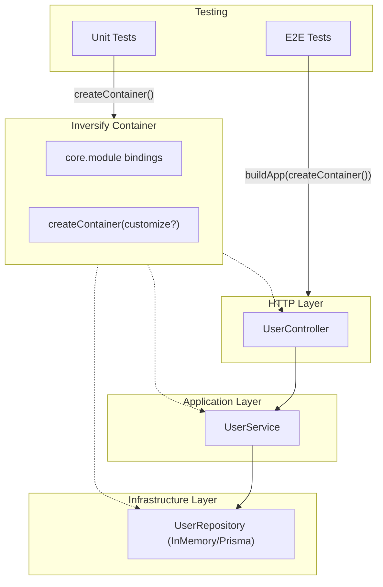

# DI Overview Diagram (Mermaid)

```mermaid
flowchart TD
  subgraph Web["HTTP Layer"]
    C["UserController"]
  end

  subgraph App["Application Layer"]
    S["UserService"]
  end

  subgraph Infra["Infrastructure Layer"]
    R["UserRepository (InMemory/Prisma)"]
  end

  subgraph DI["Inversify Container"]
    M["core.module bindings"]
    F["createContainer(customize?)"]
  end

  %% Main application flow
  C --> S
  S --> R

  %% Dependency injection
  DI -.-> C
  DI -.-> S
  DI -.-> R

  %% Testing flows
  subgraph Tests["Testing"]
    T1["Unit Tests"]
    T2["E2E Tests"]
  end

  T1 -->|"createContainer()"| DI
  T2 -->|"buildApp(createContainer())"| Web
```
